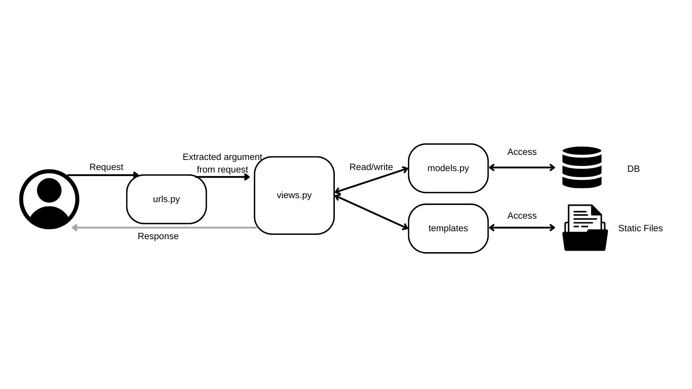
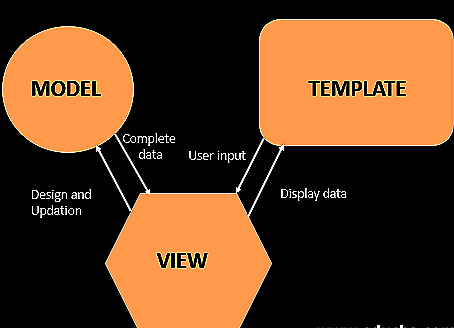
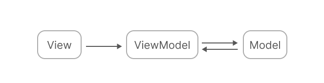
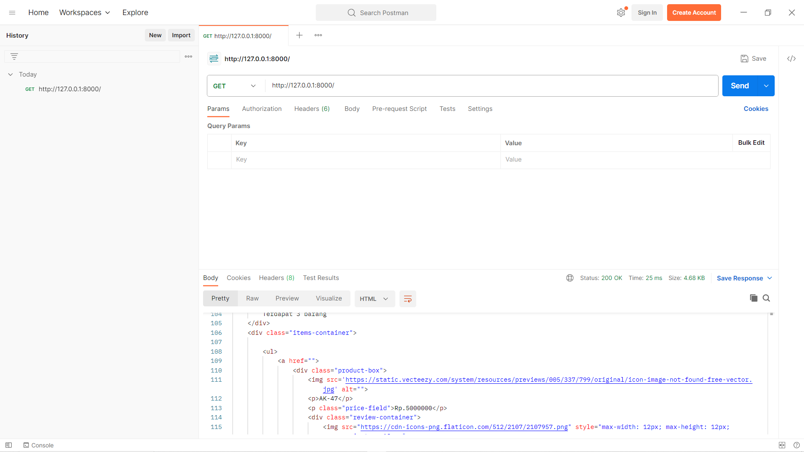
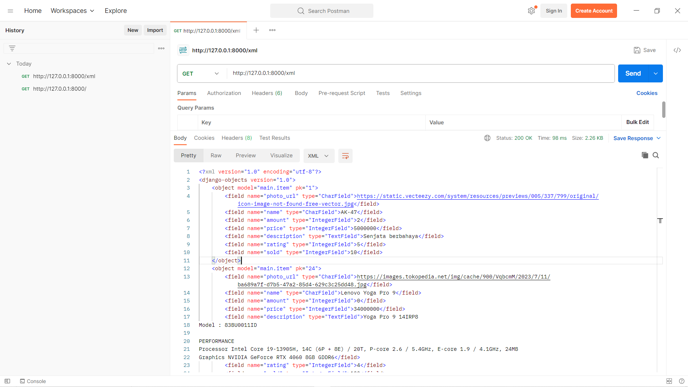
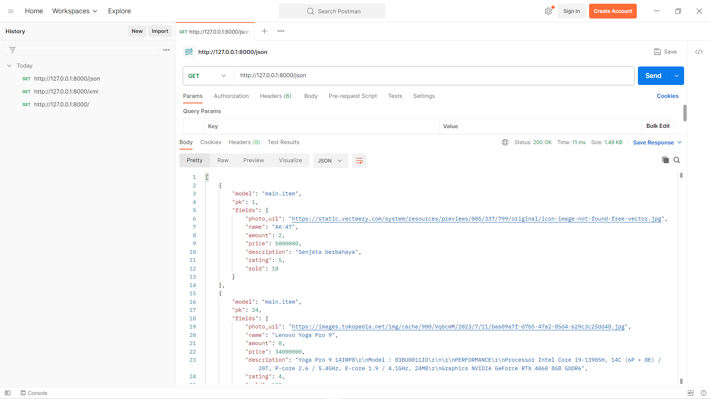
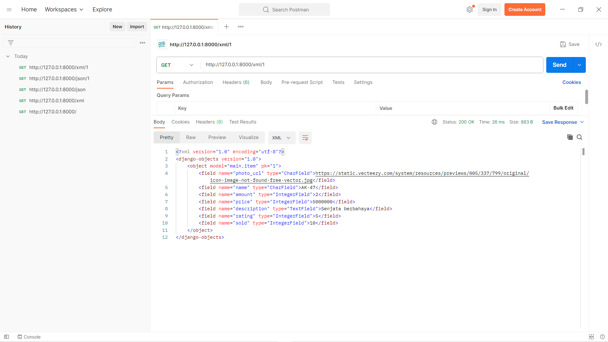
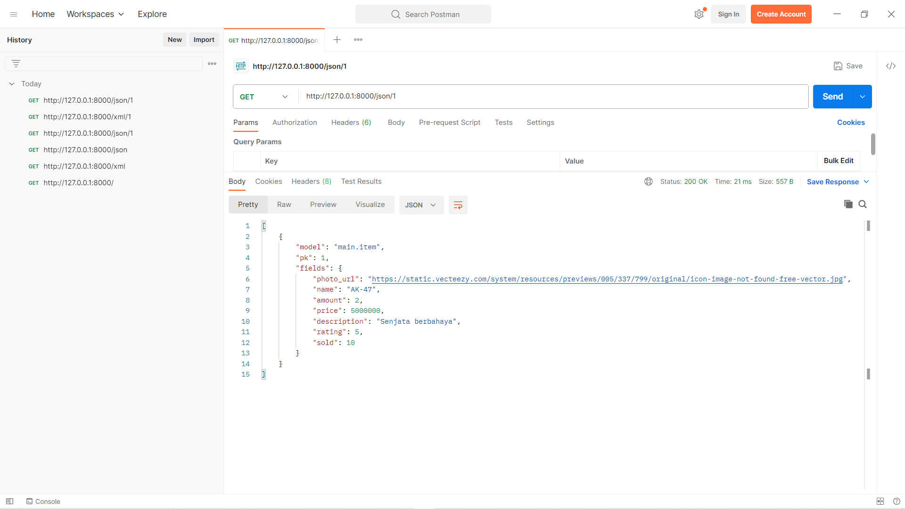
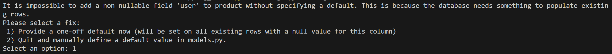
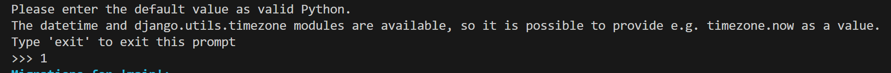

link aplikasi adaptable: https://tokopakedi-tugas2.adaptable.app
# Tugas 2

## Implementasi Setiap Checklist yang Ada

#### Membuat sebuah proyek Django baru.
1. Membuat folder baru
2. Membuat _virtual environment_ dengan menjalankan ```python -m venv env```
3. Masuk ke dalam virtual environment dengan menjalankan ```env\Scripts\activate.bat```
4. Buat file `requirements.txt` yang berisi _dependencies_ yang diperlukan. File tersebut berisi
    ```
    django
    gunicorn
    whitenoise
    psycopg2-binary
    requests
    urllib3
    ```
5. Membuat proyek Django yang baru bernama `tokopakedi` dengan menjalankan
    ```
    django-admin startproject tokopakedi .
    ```

### Membuat aplikasi dengan nama main pada proyek tersebut
1. Membuat aplikasi `main` baru dengan menjalankan 
    ```
    python manage.py startapp main
    ```
2. Mendaftarkan aplikasi `main` yang telah dibuat dengan membuka `settings.py` lalu tambahkan
    ```
        INSTALLED_APPS = [
        ...,
        'main',
        ...
        ]
    ```
### Melakukan routing pada proyek agar dapat menjalankan aplikasi main.
1. Buka `urls.py` dalam direktori `tokopakedi` lalu tambahkan
    ```
    urlpatterns = [
        path('admin/', admin.site.urls),
        path('', include('main.urls')),
    ]
    ```
    url patterns admin digunakan agar bisa membuka admin site django. Sedangkan `main.urls` berguna agar aplikasi `main` dapat diakses

### Membuat model pada aplikasi main dengan nama Item
1. Buka `models.py` lalu tambahkan 
    ```
    class Item(models.Model):
    photo_url = models.CharField(max_length=512, default="https://static.vecteezy.com/system/resources/previews/005/337/799/original/icon-image-not-found-free-vector.jpg")
    name = models.CharField(max_length=255)
    amount =  models.IntegerField(default=0)
    price =  models.IntegerField(default=0)
    description = models.TextField()
    rating =  models.IntegerField(default=0)
    sold =  models.IntegerField(default=0)
    ```
2. Lakukan migrasi model dengan menjalankan
    ```
    python manage.py makemigrations
    ```
3. Menerapkan migrasi ke dalam basis data lokal dengan menjalankan 
    ```
    python manage.py makemigrations
    ```

### Membuat sebuah fungsi pada views.py untuk dikembalikan ke dalam sebuah template HTML yang menampilkan nama aplikasi serta nama dan kelas kamu.
1. Buka `views.py` pada direktori `main` lalu tambahkan fungsi berikut
    ```
    def show_main (request):
    template = loader.get_template('main.html')
    context = {
        "nama":"Muhamad Rifqi",
        "kelas":"PBP F",
        "nama_aplikasi":"tokopakedi"
    }
    return HttpResponse(template.render(context, request))

    def show_home (request):
    template = loader.get_template('home.html')
    context = {
        "items":Item.objects.all().values()
    }
    return HttpResponse(template.render(context, request))
    ```
    Fungsi show_main berfungsi untuk mengembalikan `main.html` template jika dipanggil dan memberikan data melalui `context`.
    Fungsi show_home berfungsi untuk mengembalikan `home.html` template jika dipanggil dan memberikan data melalui `context`.
2. Tambahkan direktori `templates` di dalam direktori `main`. Direktori `templates` berguna untuk menyimpan template-template html file yang akan dipanggi jika diperlukan
3. Membuat `main.html` dan `home.html` sesuai dengan ketentuan. Hias sedikit dengan menggunakan css style

### Membuat sebuah routing pada urls.py aplikasi main untuk memetakan fungsi yang telah dibuat pada views.py.
1. Buat `urls.py` pada direktori main lalu tambahkan
    ```
    from django.urls import path
    from . import views

    app_name = 'main'

    urlpatterns = [
        path('', views.show_main, name='show_home'),
        path('home/', views.show_home, name='show_home'),
    ]
    ```
    http://127.0.0.1:8000/: memamnggil fungsi show_main pada views, lalu menampilkan `main.html`
    http://127.0.0.1:8000/home: memamnggil fungsi show_home pada views, lalu menampilkan `home.html`

### Melakukan deployment ke Adaptable
1. Simpan kode yang telah dibuat lalu diunggah ke github repository
2. Hubungkan Adaptable dengan github repository

## Bagan yang berisi request client ke web aplikasi berbasis Django


Berikut adalah alur responnya:
1. User request kepada `urls.py`
2. `urls.py` akan memanggil function di `views.py` sesuai dengan _pattern_ urlnya
3. `views.py` mengakses `models.py` untuk membaca atau menulis data ke _database_ melalui `models.py`
4. `views.py` juga mengakses berkas-berkas yang ada di `templates` untuk memanggil file-file yang sesuai (termasuk berkas-berkas `html`)
5. `views.py` mengembalikan response dengan data yang diambil dari `models.py` dan fiile-file yang ada di templates (termasuk `html`)

## Mengapa menggunakan _virtual environment_?
_Virtual environment_ digunakan untuk menjaga _dependencies_ yang dibutuhkan dari setiap proyek yang ada. Sebagai contoh jika kita mengerjakan banyak proyek django, maka kita bisa membedakan dan menjaga _dependencies_ dari setiap proyek yang ada. Bisa saja setiap proyek memiliki versi dan _dependencies_ yang berbeda-beda.

#Apakah bisa membuat aplikasi web berbasis Django tanpa menggunakan _virtual environment_?
Ya, tetap bisa. Namun tidak disarankan melakukan seperti itu. Hal tersebut akan sangat menyulitkan apabila misalkan, saat ini kita membuat proyek a. Lalu pada 3 tahun lagi, kita ingin mengubah proyek a kembali. Namun, sudah ada banyak pembaruan versi dari _dependencies_ yang kita gunakan. Sehingga bisa saja _packages_ yang kita miliki saat ini tidak sesuai dengan versi Django proyek 3 tahun yang lalu.

## Apakah itu MVC, MVT, MVVM dan perbedaannya?

### MVC (Model, View, Controller)

(https://www.dicoding.com/blog/apa-itu-mvc-pahami-konsepnya/)

MVC adalah salah satu arsitektur dalam membuat aplikasi. Arsitektur ini memisahkan kode menjadi tiga bagian, yakni:
* Model: Mengatur segala hal yang berkaitan dengan data di dalam database
* View: Mengatur segala hal yang berkaitan dengan apa yang akan ditampilkan kepada pengguna dalam bentuk GUI. Sebagai contoh berkaitan dengan html dan css
* Controller: Sebgai jembatan antara model dan view

### MVT (Model, View, Template)

(https://www.geeksforgeeks.org/django-project-mvt-structure/)

MVC adalah salah satu arsitektur dalam membuat aplikasi. Arsitektur ini memisahkan kode menjadi tiga bagian, yakni:
* Model: Mengatur segala hal yang berkaitan dengan data di dalam database
* b. View: Sebagai jembatan antara model dan template.
* Template: Mengatur segala hal yang berkaitan dengan apa yang akan ditamplkan kepada pengguna. Sebagai contoh berkaitan dengan html dan css

### MVVM (Model, View, View Model)

(https://www.dicoding.com/blog/tips-design-pattern-mvvm/)

* Model: Mengatur segala hal yang berkaitan dengan data
* View: Mengatur segala hal yang berkaitan dengan apa yang akan ditampilkan kepada pengguna. Sebagai contoh berkaitan dengan html dan css
* View model: Berinteraksi dengan model lalu datanya diterukan ke view.

# Tugas 3

## Apa perbedaan antara form POST dan form GET dalam Django?
* POST
    1. Digunakan untuk mengirim data ke web server
    2. Sedikit lebih aman karena tidak terdapat data yang dikirim melalui URL.
    3. Tidak tersimpan di _browser_ _history_ dan _cache memory browser_
    4. POST _request_ tidak dapat di-_bookmark_ di _browser_

* GET
    1. Digunakan untuk membaca/mengambil data dari web server
    2. Sedikit tidak lebih aman karena terdapat data yang dikirim melalui URL
    3. Tersimpan di _browser_ _history_ dan _cache memory browser_
    4. GET _request_ dapat di-_bookmark_ di _browser_


## Apa perbedaan utama antara XML, JSON, dan HTML dalam konteks pengiriman data?
* XML
    1. XML adalah singkatan dari Extensible Markup Language
    2. Menggunakan konsep _tag_ dan _attribute_ dalam format datanya.
* JSON
    1. JSON adalah singkatan dari JavaScript Object Notation
    2. Menggunakan konsep_key and value_ dalama format datanya.
* HTML
    1. HTML adalah singkatan dari JHyperText Markup Language
    2. Menggunakan konsep _tag_ dan _attribute_ dalam format datanya.

## Mengapa JSON sering digunakan dalam pertukaran data antara aplikasi web modern?
1. File JSON berukuran kecil sehingga dalam proses pertukaran data berjalan dengan cepat.
2. Format penulisan JSON lebih mudah dibaca oleh manusia, sehingga lebih mudah digunakan.
3. Hampir semua _browser_ yang populer digunakan saat ini mendukung penggunaan JSON.

## Jelaskan bagaimana cara kamu mengimplementasikan checklist di atas secara step-by-step (bukan hanya sekadar mengikuti tutorial).

### Membuat input `form` untuk menambahkan objek model pada app sebelumnya
1. Membuat file `forms.py` yang akan digunakan untuk membuat struktur _form_ yang dapat digunakan untuk menerima data baru. 
```
from django.forms import ModelForm
from main.models import Item

class ItemForm(ModelForm):
    class Meta:
        model = Item
        fields = ["photo_url", "name", "amount","price", "description", "rating","sold"]
```
2. Tambahkan _import_ yang dibutuhkan dalam file `views.py` yang ada pada folder `main`
```
from django.http import HttpResponseRedirect
from main.forms import ProductForm
from django.urls import reverse
```
3. Membuat fungsi `create_product` dalam file `views.py` dalam folder `main` yang akan dipanggil jika kita ingin menambahkan Item baru.
```
def create_product(request):
    form = ItemForm(request.POST or None)
    print(form)
    if form.is_valid() and request.method == "POST":
        form.save()
        return HttpResponseRedirect(reverse('main:show_home'))

    context = {'form': form}
    return render(request, "create_product.html", context)
```
4. Ubah fungsi `show_main` dalam file `views.py` dalam folder `main` menjadi seperti berikut agar bisa menampilkan semua `Item` yang ada:
```
def show_main (request):
  template = loader.get_template('home.html')
  context = {
    "items":Item.objects.all().values(),
    "nama":"Muhamad Rifqi",
    "kelas":"PBP F",
    "nama_aplikasi":"tokopakedi"
  }   
  return HttpResponse(template.render(context, request))
```
5. Tambahkan kode berikut ke dalam `urls.py` dalam folder `main`
```
from main.views import show_main, create_product
```
6. Tambahkan _path_ baru ke dalam `urls.py` yang ada di dalam folder `main`
```
    . . .
    path('create-product', views.create_product, name='create_product'),
    . . .
```
7. Buat berkas _template_ HTML `create_product.html` yang baru di dalam folder `templates` 
```
<!DOCTYPE html>
<html lang="en">
<head>
    <meta charset="UTF-8">
    <meta name="viewport" content="width=device-width, initial-scale=1.0">
    <title>Document</title>
    <style>
        body{
            margin: 0px;
        }
        h1, h2{
            color: white;
            text-align: left;
            margin: 5px;
        }
        header{
            display: flex;
            flex-direction: row;
            justify-content: space-between;
            background-color: green;
            height: 125px;
            position: fixed;
            top: 0;
            min-width: 100%;
            /* z-index: 9999; */
        }
        main{
            display: flex;
            flex-direction: row;
            padding-top: 150px;
        }
        aside{
            flex: 3;
        }
        form{
            flex: 4;
        }
        .form-field{
            display: flex;
            flex-direction: column;
        }
        .form-field div{
            padding-left: 10px;
        }
        .form-field p{
            min-width: 120px;
            /* background-color: ; */
        }
        input{
            border-radius: 5px;
            border-color: grey;
            border-style: solid;
        }
    </style>
</head>
<body>
    <header>
        <div class="title">
            <h1>tokopakedi</h1>
        </div>
        <a class="create-product-button" href="">
            <i class="fa fa-plus-circle" style="font-size:24px;color: white;"></i>
        </a>
    </header>

    <main>
        <form method="POST">
            
            <table>
                <!-- {{ form.as_table }} -->
                <div class="form-field">
                    <p>Photo Url</p>
                    <div class="photo-url">{{form.photo_url}}</div>
                </div>
                <div class="form-field">
                    <p>Product Name</p>
                    <div class="name">{{form.name}}</div>
                </div>
                <div class="form-field">
                    <p>Amount</p>
                    <div class="amount">{{form.amount}}</div>
                </div>
                <div class="form-field">
                    <p>Price</p>
                    <div class="price">{{form.price}}</div>
                </div>
                <div class="form-field">
                    <p>Description</p>
                    <div class="description">{{form.description}}</div>
                </div>
                <div class="form-field">
                    <p>Rating</p>
                    <div class="rating">{{form.rating}}</div>
                </div>
                <div class="form-field">
                    <p>Sold</p>
                    <div class="sold">{{form.sold}}</div>
                </div>
                <tr>
                    <td></td>
                    <td>
                        <input type="submit" value="Add Product"/>
                    </td>
                </tr>
            </table>
        </form>
    </main>
</body>
</html>
```
8. Tambahkan `main.html` menjadi kode berikut agar bisa menampilkan semua `Item` yang ada
```
<!DOCTYPE html>
<html lang="en">
<head>
    <meta charset="UTF-8">
    <meta name="viewport" content="width=device-width, initial-scale=1.0">
    <title>Document</title>
    <link rel="stylesheet" href="https://cdnjs.cloudflare.com/ajax/libs/font-awesome/4.7.0/css/font-awesome.min.css">    
    <style>
        body{
            margin: 0px;
        }
        header{
            display: flex;
            flex-direction: row;
            justify-content: space-between;
            background-color: green;
            height: 125px;
            position: fixed;
            top: 0;
            z-index: 9998;
            min-width: 100%;
        }
        .title{
            text-align: left;
            display: flex;
            flex-direction: column;
            justify-content: center;
            padding-left: 30px;
        }
        .create-product-button{
            padding-right: 30px;
            display: flex;
            flex-direction: column;
            justify-content: center;
        }

        h1, h2{
            color: white;
            text-align: left;
            margin: 5px;
        }
        .product-box{
            display: flex;
            border-radius: 10px;
            flex-direction: column;
            border-style: double;
            max-width:120px ;
        }
        .product-box p{
            padding-left: 2px;
            padding-right: 2px;
        }
        .price-field{
            font-weight: bold;
        }

        a{
            color: inherit;
            text-decoration: none;
        }
        img{
            max-width: 500px;
        }

        .review-container{
            display: flex;
            flex-direction: row;
        }
        .total-items{
            padding-top: 125px;
        }
        .items-container{
            display: flex;
            flex-direction: row;
            justify-content: start;
            flex-wrap: wrap;
            padding-top: 10px;
        }

    </style>
</head>
<body>
    
    <header>
        <h1>tokopakedi</h1>
        <a class="create-product-button" href="">
            <i class="fa fa-plus-circle" style="font-size:24px;color: white;"></i>
        </a>
    </header>
    <div class="total-items">
        <p>Nama: {{nama}}</p>
        <p>Kelas: {{kelas}}</p>
        Terdapat {{items|length}} barang
    </div>
    <!--  -->
    <!--  -->
    <div class="items-container">
        
        <ul>
            <a href="">
                <div class="product-box">
                    
                    <p>{{x.name}}</p>
                    <p class="price-field">Rp.{{x.price}}</p>
                    <div class="review-container">
                        
                        <p>{{x.rating}} | </p>
                        <p>{{x.sold}} terjual</p>
                    </div>
                </div>
            </a>
        </ul>
        
    </div>
</body>

</html>
```

### Tambahkan 5 fungsi views untuk melihat objek yang sudah ditambahkan dalam format HTML, XML, JSON, XML by ID, dan JSON by ID.
1. Menambahkan fungsi `show_xml` di dalam `views.py` folder `main` yang berguna untuk menampilkan semua `Item` yang ada dalam bentuk xml
```
def show_xml(request):
    data = Item.objects.all()
    return HttpResponse(serializers.serialize("xml", data), content_type="application/xml")
```
2. Menambahkan fungsi `show_json` di dalam `views.py` folder `main` yang berguna untuk menampilkan semua `Item` yang ada dalam bentuk JSON
```
def show_json(request):
    data = Item.objects.all()
    return HttpResponse(serializers.serialize("json", data), content_type="application/json")
```
3. Menambahkan fungsi `show_xml_by_id` di dalam `views.py` folder `main` yang berguna untuk menampilkan `Item` yang sesuai dengan `id` yang diminta dalam bentuk xml
```
def show_xml_by_id(request, id):
    data = Item.objects.filter(pk=id)
    return HttpResponse(serializers.serialize("xml", data), content_type="application/xml")
```
4. Menambahkan fungsi `show_json_by_id` di dalam `views.py` folder `main` yang berguna untuk menampilkan `Item` yang sesuai dengan `id` yang diminta dalam bentuk JSON
```
def show_json_by_id(request, id):
    data = Item.objects.filter(pk=id)
    return HttpResponse(serializers.serialize("json", data), content_type="application/json")
```
5. Tambahkan fungsi `show_main` yang berguna untuk menampilkan semua `Item` yang ada dalam bentuk HTML (sudah ada di tugas sebelumnya, tetapi ada sedikit perubahan)
```
def show_main (request):
  template = loader.get_template('home.html')
  context = {
    "items":Item.objects.all().values(),
    "nama":"Muhamad Rifqi",
    "kelas":"PBP F",
    "nama_aplikasi":"tokopakedi"
  }   
  return HttpResponse(template.render(context, request))
```

### Membuat routing URL untuk masing-masing views yang telah ditambahkan pada poin 2.
File `urls.py` yang ada di dalam folder `main` menjadi seperti berikut:
```
from django.urls import path
from . import views

app_name = 'main'

urlpatterns = [
    path('', views.show_main, name='show_home'),
    path('create-product', views.create_product, name='create_product'),
    path('xml/', views.show_xml, name='show_xml'), 
    path('json/', views.show_json, name='show_xml'), 
    path('xml/<int:id>/', views.show_xml_by_id, name='show_xml_by_id'),
    path('json/<int:id>/', views.show_json_by_id, name='show_json_by_id'), 
]
```
Penjelasan:
1. `path('', views.show_main, name='show_home'),` berguna untuk memanggil fungsi `show_main` yang ada di dalam `views.py` untuk menampilkan semua `Item` yang ada dalam bentuk HTML.
2. `path('create-product', views.create_product, name='create_product'),` berguna untuk memanggil fungsi `create_product` yang ada di dalam `views.py` untuk menambahakn `Item` baru.
3. `path('xml/', views.show_xml, name='show_xml'),` berguna untuk memanggil fungsi `show_xml` yang ada di dalam `views.py` untuk menampilkan semua `Item` yang ada dalam bentuk xml.
4. `path('json/', views.show_json, name='show_json'),` berguna untuk memanggil fungsi `show_json` yang ada di dalam `views.py` untuk menampilkan semua `Item` yang ada dalam bentuk JSON.
5. `path('xml/<int:id>/', views.show_xml_by_id, name='show_xml_by_id'),` berguna untuk memanggil fungsi `show_xml_by_id` yang ada di dalam `views.py` untuk menampilkan `Item` yang sesuai dengan `id` dalam bentuk xml.
6. `path('json/<int:id>/', views.show_json_by_id, name='show_json_by_id'),` berguna untuk memanggil fungsi `show_json_by_id` yang ada di dalam `views.py` untuk menampilkan `Item` yang sesuai dengan `id` dalam bentuk json.

## Mengakses URL menggunakan Postman
1. `main.html`


2. XML


3. JSON


4. XML by id


5. JSON by id


## Bonus
Tambahkan kode berikut di bawah tag header dalam `main.html`
```
    <div class="total-items">
        <p>Nama: {{nama}}</p>
        <p>Kelas: {{kelas}}</p>
        Terdapat {{items|length}} barang
    </div>
```
Potongan kode tersebut berguna untuk menampilkan nama, kelas, dan juga total `Item` yang tersimpan.

# Tugas 4

## Apa itu Django UserCreationForm, dan jelaskan apa kelebihan dan kekurangannya?
Django UserCreationForm adalah _built-in class_ Django yang berguna untuk membuat _user_. _Class_ ini memiliki beberapa _field_ bawaan seperti _username_, _password1_, dan _password2_ (yang berguna untuk konfirmasi _password_).

* Kelebihan Django UserCreationForm:
    1. Kita tidak perlu menulis banyak kode untuk membuat _user_. Kita bisa langsung menggunakan _class_ bawaan dari Django untuk membuat _user_.
    2. Terdapat beberapa fitur pengecekan dan kemanan bawaan. Seperti ketentuan _username_ dan _password_ yang dapat digunakan.
    3. Dapat meng-_handle_ _traffic_ yang cukup tinggi.
* Kekurangan Django UserCreationForm:
    1. Apabila proyek yang digunakan kecil, maka akan terlalu banyak hal yang harus dilakukan agar dapat menggunakan Django UserCreationForm.
    2. Harus belajar banyak hal baru yang berkaitan dengan Django UserCreationForm.

##  Apa perbedaan antara autentikasi dan otorisasi dalam konteks Django, dan mengapa keduanya penting?
* Autentikasi
    1. Proses pengecekan identitas untuk menentukan apakah seseorang itu _user_ atau bukan
    2. Proses memverifikasi _user_
    3. Dilakukan sebelum otorisasi
    4. Biasanya menggunakan _username_, _face recoginition_, _fingerprint_, dan lain-lain
    5. Data-data yang diberikan oleh _user_ dapat diubah oleh _user_

* Otorisasi
    1. Proses pengecekan akses apa saja yang dapat dilakukan oleh user
    2. Proses memvalidasi _user_
    3. Dilakukan setelah autentikasi
    4. Biasanya menggunakan _role user_ yang telah didefinisikan
    5. _User_ tidak dapat mengubah akses yang telah diberikan oleh pemilik sistem

## Apa itu cookies dalam konteks aplikasi web, dan bagaimana Django menggunakan cookies untuk mengelola data sesi pengguna?
* Cookies adalah data kecil yang dikirimkan oleh _web server_ kepada _browser_ yang berguna untuk menyimpan informasi kita sebagai user. Manfaatnya adalah jika kita membuka _website_ tersebut lagi, dapat meningkatkan pengalaman penggunaan. 
* Django memanfaat _cookies_ untuk menyimpan _Session ID_. _Session ID_ ini yang akan dikirmkan oleh _browser_ kepada _web server_ sehingga _website_ dapat menampilkan data yang diperlukan.Pendekatan seperti itu juga lebih aman karena _cookies_ hanya menyimpan _Session ID_.

## Apakah penggunaan cookies aman secara default dalam pengembangan web, atau apakah ada risiko potensial yang harus diwaspadai?
Secara umum, _cookies_ aman digunakan dalam pengembangan _web_. Namun, bukan berarti tidak ada potensial risiko yang harus diwaspadai. Berikut adalah contoh risiko potensial penggunaan _cookies_:
1. Data di dalam _cookies_ bisa saja dicuri oleh _hacker_. Sehingga, _hacker_ dapat dapat mencuri identitas _user_. 
2. _Cookies_ juga mungkin saja tidak bekerja dengan baik pada semua jenis dan versi _browser_
3. _Cookies_ juga meningkatkan _bandwidth_ komunikasi antara _client_ dan _server_

## Implementasi Checklist

### Mengimplementasikan fungsi registrasi, login, dan logout untuk memungkinkan pengguna untuk mengakses aplikasi sebelumnya dengan lancar.
* Implementasi registrasi
    1. Masuk ke dalam virtual environment
    2. Tambahkan _import_ berikut ke dalam `views.py`
    ```
    from django.shortcuts import redirect
    from django.contrib.auth.forms import UserCreationForm
    from django.contrib import messages 
    ```
    3. Tambahkan fungsi untuk registrasi pada `views.py` 
    ```
    def register(request):
        form = UserCreationForm()

        if request.method == "POST":
            form = UserCreationForm(request.POST)
            if form.is_valid():
                form.save()
                messages.success(request, 'Your account has been successfully created!')
                return redirect('main:login')
        context = {'form':form}
        return render(request, 'register.html', context)
    ```
    4. Tambahkan HTML baru `register.html` di dalam `main/templates`
    ```
    

    
        <title>Register</title>
        <style>
            body{
                margin: 0px;
            }

            .tokopakedi-h1{
                color: white;
                margin: 5px;
            }
            header{
                display: flex;
                flex-direction: row;
                justify-content:center;
                background-color: green;
                height: 125px;
                position: fixed;
                top: 0;
                min-width: 100%;
            }

            .login{
                padding-top: 250px;
                display: flex;
                flex-direction: row;
                justify-content: center;
            }
            .login-container{
                width: 300px;
                display: flex;
                flex-direction: column;
                box-shadow:0 0 2px 2px grey;
                border-radius: 10px;
                
                padding: 20px;
            }
            .login-field{
                margin-bottom: 20px;
            }
            input{
                width: 100%;
                height: 30px;
                border-radius: 10px;

            }
            .btn-login_btn{
                background-color: green;
                color: white;
            }
            .btn-login_btn:hover{
                cursor: pointer;
                color: whitesmoke;
                background-color: darkgreen;
            }
            
        </style>
    

      
    <header>
        <h1 class="tokopakedi-h1">tokopakedi</h1>
    </header>

    <div class = "login">
        <div class="login-container">

            <h1>Register</h1>  
        
                <form method="POST" >  
                      
                    <table>  
                        {{ form.as_div }}  
                        <tr>  
                            <div class="login-field">
                                <div class="username-field"></div>
                            </div>
                            <div class="login-field">
                                <div class="ppassword-field"></div>
                            </div>
                            <div class="login-field">
                                <div class="ppassword-confirmation-field"></div>
                            </div>
                            <input class="btn-login_btn" type="submit" name="submit" value="Daftar"/>
                            <p>Already registered? <a href="">Login</a> </p>
                        </tr>  
                    </table>  
                </form>
        
              
                <ul>   
                      
                        <li>{{ message }}</li>  
                          
                </ul>   
            
        </div>

    </div>  

    
    ```
    5. Tambahkan _path url_ nya ke dalam `urls.py` yang ada di dalam `main`
    ```
    ...
        path('register/', views.register, name='register'),

    ...
    ```
* Implementasi _login_
    1. Tambahkan _import_ pada `views.py`
    ```
    from django.contrib.auth import authenticate, login
    ```
    2. Tambahkan fungsi _login_ pada `views.py`
    ```
    def login_user(request):
        if request.method == 'POST':
            username = request.POST.get('username')
            password = request.POST.get('password')
            user = authenticate(request, username=username, password=password)
            if user is not None:
                login(request, user)
                response = HttpResponseRedirect(reverse("main:show_main")) 
                response.set_cookie('last_login', str(datetime.datetime.now()))
                return response
            else:
                messages.info(request, 'Sorry, incorrect username or password. Please try again.')
        context = {}
        return render(request, 'login.html', context)
    ```
    3. Tambahkan `login.html` pada `main/templates`
    ```
    

    
        <title>Login</title>
        <style>
            body{
                margin: 0px;
            }
            .tokopakedi-h1{
                color: white;
                margin: 5px;
            }
            header{
                display: flex;
                flex-direction: row;
                justify-content:center;
                background-color: green;
                height: 125px;
                position: fixed;
                top: 0;
                min-width: 100%;
                /* z-index: 9999; */
            }

            .login{
                padding-top: 250px;
                display: flex;
                flex-direction: row;
                justify-content: center;
            }
            .login-container{
                width: 300px;
                display: flex;
                flex-direction: column;
                box-shadow:0 0 2px 2px grey;
                border-radius: 10px;
                
                padding: 20px;
            }
            .login-field{
                margin-bottom: 20px;
            }
            input{
                width: 100%;
                height: 30px;
                border-radius: 10px;

            }
            .btn-login_btn{
                background-color: green;
                color: white;
            }
            .btn-login_btn:hover{
                cursor: pointer;
                color: whitesmoke;
                background-color: darkgreen;
            }
            
        </style>
    

    
    <header>
        <h1 class="tokopakedi-h1">tokopakedi</h1>
    </header>

    <div class = "login">

        <div class="login-container">

            <h1>Login</h1>
        
            <form method="POST" action="">
                
                <table>
                    <div class="login-field">
                        <p>Username</p>
                        <input type="text" name="username" placeholder="Username" class="form-control">
                    </div>
                    <div class="login-field">
                        <p>Password</p>
                        <input type="password" name="password" placeholder="Password" class="form-control">
                    </div>
                    <input class="btn-login_btn" type="submit" value="Login">
                </table>
            </form>
        
            
                <ul>
                    
                        <li>{{ message }}</li>
                    
                </ul>
                 
            <div class="register-container">
                <p>Don't have an account yet?</p>
                <a href="">Register Now</a>
            </div>

        </div>

    </div>

    
    ```
    4. Tambahkan _path_ baru pada `urls.py`
    ```
    ...
    path('login/', views.login_user, name='login'), 
    ...
    ```
    5. Untuk meretriksi halaman _main_, tambahkan _import_ baru pada `views.py`
    ```
    from django.contrib.auth.decorators import login_required
    ```
    6. Tambahkan kode berikut di `views.py`
    ```
    ...
    @login_required(login_url='/login')
    def show_main(request):
    ...
    ```
* Implementasi _logout_
    1. Tambakan _import_ baru pada `views.py`
    2. Tambahkan fungsi _logout_ pada `views.py`
    ```
    def logout_user(request):
        logout(request)
        response = HttpResponseRedirect(reverse('main:login'))
        response.delete_cookie('last_login')
        return response
    ```
    3. Tambahkan _hyperlink_ yang baru pada berkas `main.html`
    ```
    <a href="">
        <i class="fa fa-sign-out" style="font-size:24px;color: white;"></i>
    </a>
    ```
    4. Tambahkan _path_ baru pada `urls.py`
    ```
    ...
    path('logout/', views.logout_user, name='logout'),
    ...
    ```

## Membuat dua akun pengguna dengan masing-masing tiga dummy data menggunakan model yang telah dibuat pada aplikasi sebelumnya untuk setiap akun di lokal.
1. Buka _register page_ pada aplikasi
2. Tambahkan user dengan ketentuan sebagai berikut:
    1) _username_: test, _password_: testdoang
    2) _username_: test2, _password_: test2doang
3. _Login_ pada tiap _user_, lalu tambahkan _item_ melalui _create product page_ dengan cara klik ikon tambah. Tambahkan _item_ sebanyak 3 pada masing-masing akun _user_ 


## Menghubungkan model Item dengan User.
1. Tambahkan _import_ baru di `models.py`
```
...
from django.contrib.auth.models import User
...
```
2. Tambahkan _field_ baru di `models.py`
```
...
class Item(models.Model):
  user = models.ForeignKey(User, on_delete=models.CASCADE)
...
```
3. Ubah fungsi `create_product` di `views.py` menjadi berikut
```
def create_product(request):
    form = ItemForm(request.POST or None)

    if form.is_valid() and request.method == "POST":
        product = form.save(commit=False)
        product.user = request.user
        product.save()
        return HttpResponseRedirect(reverse('main:show_main'))
    context = {'form': form}
    return render(request, "create_product.html", context)
```
4. Ubah fungsi `show_main` di `views.py` menjadi berikut
```
@login_required(login_url='/login')
def show_main (request):
    items = Item.objects.filter(user=request.user)
    template = loader.get_template('main.html')
    context = {
        "items":items,
        "name":request.user.username,
        "nama_aplikasi":"tokopakedi",
        'last_login': request.COOKIES['last_login'],
        }   
    return HttpResponse(template.render(context, request))
```
5. Lakukan migrasi pada `models.py`
6. 
7. 

## Menampilkan detail informasi pengguna yang sedang logged in seperti username dan menerapkan cookies seperti last login pada halaman utama aplikasi.
1. _Logout_ terlebih dahulu dari aplikasi jika sedang _login_
2. _Import_ kode berikut di `views.py`
```
import datetime
from django.http import HttpResponseRedirect
from django.urls import reverse
```
3. Tambahkan potongan kode tersebut pada fungsi `login_user` di `views.py`
```
if user is not None:
    login(request, user)
    response = HttpResponseRedirect(reverse("main:show_main")) 
    response.set_cookie('last_login', str(datetime.datetime.now()))
    return response
```
4. Tambahkan kode tersebut pada `context` di `show_main` yang ada di `views.py`
```
...
'last_login': request.COOKIES['last_login'],
...
```
5. Tambahkan kode berikut pada fungsi `logout_user` di `views.py` untuk menghapus _cookies_ jika _logout_
```
...   
response.delete_cookie('last_login')
...
```
6. Tambagkan potongan kode berikut pada `main.html` untuk menginformasikan data _last login_ _user_

## Bonus
1. Tambahkan potongan kode berikut pada `product-box` di `main.html`
```
<div class="change-amount-btn">
    <form method="POST" action="">
        
        <button type="submit" class="btn btn-success btn-sm">+1</button>
    </form>
    <form method="POST" action="">
        
        <button type="submit" class="btn btn-danger btn-sm">-1</button>
    </form>
    <form method="POST" action="">
        
        <button type="submit" class="btn btn-danger btn-sm">Del</button>
    </form>
</div>
```
Kode di atas ditambahkan agar apabila _button_ tertentu di klik, akan membuka _url_ tertentu dan akan meneruskan _id item_

2. Tambahkan fungsi berikut pada `views.py`
```
def increase_amount(request, id):
    item = get_object_or_404(Item, pk=id)
    item.amount += 1
    item.save()
    return redirect('main:show_main')

def decrease_amount(request, id):
    item = get_object_or_404(Item, pk=id)
    if(item.amount > 0):
        item.amount -= 1
    item.save()
    return redirect('main:show_main')

def remove_item(request, id):
    item = get_object_or_404(Item, pk=id)
    item.delete()
    return redirect('main:show_main')
```
Fungsi di atas berguna untuk mendapatkan _item_ sesudai _id_ dan mengubah _amount_ dari _item_ sesuai dengan ketentuan

3. Tambahkann _path_ baru di `urls.py`
```
...
path('increase_amount/<int:id>/', views.increase_amount, name='increase_amount'),
path('decrease_amount/<int:id>/', views.decrease_amount, name='decrease_amount'),
path('remove_item/<int:id>/', views.remove_item, name='remove_item'),
...
```
_Path_ tersebut ditambahkan agar apabila terdapat pola _url_ yang diakses, maka fungsi di `views.py` dapat terpanggil

# Tugas 5

##  Jelaskan manfaat dari setiap element selector dan kapan waktu yang tepat untuk menggunakannya.
Berikut adalah beberapa manfaat dari element selector:
1. Mudah dan efisien untuk digunakan. Hal tersebut karena dapat langsung memilih seluruh tag yang dipilih di html file yang digunakan
2. Kebanyakan browser mendukung elmeent selector

Elemenet selector digunakan ketika ingin menerpapkan gaya CSS yang sama kepada semua tag html yang ada. Namun penggunaannya perlu berhati-hati karena dapat memengaruhi element-elmeent child di dalamnya

## Jelaskan HTML5 Tag yang kamu ketahui.
Ada banyak sekali tag pada HTML 5. Berikut adalah beberapa diantaranya:
1. `<a>` : Berguna untuk memberikan _hyperlink_
2. `<p>` : Untuk menulis dengan gaya seperti paragraf
3. `<h1>` sampai `<h6>` : Mendifinisikan judul dan subjudul
4. `<div>` : Membagi beberapa bagian html
5. `<form>` : Membuat formulir HTML yang dapat digunakan untuk mendapat _input_ pengguna
6. `<style>`: Ini digunakan untuk menambahkan aturan CSS langsung ke dalam dokumen HTML
7. `<nav>`: Digunakan untuk mendefinisikan menu navigasi dalam sebuah dokumen.
8. `<nav>`: Digunakan untuk mendefinisikan menu navigasi dalam sebuah dokumen.
9. `<header>`: Mendefinisikan bagian atas (header) dari sebuah halaman web, yang sering berisi judul, logo, dan elemen-elemen lainnya.
10. `<button>`: Untuk membuat tombol dalam formulir atau halaman web.
dan masih banyak html tag lainnya

## Jelaskan perbedaan antara margin dan padding.
* Margin:
    1. Area di luar elmeen HTML
    2. Mengatur jarak dengan elemen-elmeent HTML lainnya
    3. Tidak memengauhi elemen di dalamnya
* Padding:
    1. Area di antara konten dan batas elemennya
    2. Digunakan untuk mengatur jarak antara batas konten dan batas elmennya
    3. Memengaruhi elemen di dalmanya

## Jelaskan perbedaan antara framework CSS Tailwind dan Bootstrap. Kapan sebaiknya kita menggunakan Bootstrap daripada Tailwind, dan sebaliknya?
* Tailwind
    1. Lebih memberikan ruang untuk membangun desain sendiri
    2. Relatif lebih kecil ukuran filenya
* Bootstrap
    1. Terdapat banyak desain yang sudah jadi, sehingga bisa langsung diterapkan ke proyek yang kita miliki
    2. Relatif lebih besar ukura filenya

* Kapan sebaiknya memilih Tailwind atau Bootstrap
    1. Pilih Bootstrap jika ingin pengembangan lebih cepat. Hal tersebut karena Bootstrap menyediakan banyak desain yang sudah siap pakai
    2. Pilih Tailwind jika ingin memiliki tingkat kustomisasi yang tinggi
    3. Pilih Tailwind jika ingin memikirkan optimisasi _website_. Hal tersebut karena ukuran file Tailwind relatif lebih kecil
    4. Jika bekerja dengan tim, maka bisa didiskusikan ingin menggunakan yang mana. Sesuaikan dengan kemampuan dan kebiasaan tim

## Implementasi Checklist

### Kustomisasi halaman login, register, dan tambah inventori semenarik mungkin.

* Kustomisasi halaman `login`
    1. Tambahkan `div` dengan _class_ `login`. Berguna sebagai menjadi _flex container_ bagi elment di dalamnya

    ```
        .login{
            padding-top: 250px;
            display: flex;
            flex-direction: row;
            justify-content: center;
        }
    ```
    2. Tambahkan `div` dengan _class_ `login-container`. Berguna untuk menjadi _flex item_ yang akan di tengahkan dari _flex container_ nya. Div ini juga dapat digunakan sebagai _flex container_ yang akan menyimpan _flex items_ yang berisi _input_ yang akan diberikan pengguna
    ```
            .login-container{
            width: 300px;
            display: flex;
            flex-direction: column;
            box-shadow:0 0 2px 2px grey;
            border-radius: 10px;
            padding: 20px;
        }
    ```
    3. Tambahkan `login-field` yang berisi _input_ yang dapat diisi oleh _user_
    4. Hias item-item yang ada di  `login-field` dengan kode berikut
    ```
        .login-field{
            margin-bottom: 20px;
        }
        input{
            width: 100%;
            height: 30px;
            border-radius: 10px;

        }
        .btn-login_btn{
            background-color: green;
             color: white;
        }
        .btn-login_btn:hover{
            cursor: pointer;
            color: whitesmoke;
            background-color: darkgreen;
        }
    ```
     5. Hias header agar _background color_ nya berwarna hijau, dan tetap selalu berada di paling atas
    ```
        body{
            margin: 0px;
        }
        .tokopakedi-h1{
            color: white;
            margin: 5px;
        }
        header{
            display: flex;
            flex-direction: row;
            justify-content:center;
            background-color: green;
            height: 125px;
            position: fixed;
            top: 0;
            min-width: 100%;
            /* z-index: 9999; */
        }
    ```
    Jangan lupa tambahkan `padding -top` pada elemen di bawah `header` agar tidak terhalangi
    ```
        .login{
            padding-top: 250px;
            display: flex;
            flex-direction: row;
            justify-content: center;
        }
    ```


* Kustomisasi halaman `register`
    1. Tambahkan `div` dengan _class_ `regitser`. Berguna sebagai menjadi _flex container_ bagi elment di dalamnya

    ```
        .login{
            padding-top: 250px;
            display: flex;
            flex-direction: row;
            justify-content: center;
        }
    ```
    2. Tambahkan `div` dengan _class_ `register-container`. Berguna untuk menjadi _flex item_ yang akan di tengahkan dari _flex container_ nya. Div ini juga dapat digunakan sebagai _flex container_ yang akan menyimpan _flex items_ yang berisi _input_ yang akan diberikan pengguna
    ```
        .register-container{
            width: 300px;
            display: flex;
            flex-direction: column;
            box-shadow:0 0 2px 2px grey;
            border-radius: 10px;
            padding: 20px;
        }
    ```
    3. Tambahkan `form`, dan masukkan `form.as_div`, sehingga django akan menambahkan `form` nya sebagai div secara otomatis. Tambahkan `register-field` yang berisi _input_ yang dapat diisi oleh _user_
    4. Hias item-item yang ada di  `register-field` dengan kode berikut
    ```
        .register-field{
            margin-bottom: 20px;
        }
        input{
            width: 100%;
            height: 30px;
            border-radius: 10px;

        }
        .btn-register{
            background-color: green;
             color: white;
        }
        .btn-login_btn:hover{
            cursor: pointer;
            color: whitesmoke;
            background-color: darkgreen;
        }
    ```
    5. Masukkan `messages` yang secara _default_ ada pada django
    6. Tambahkan `header` pada HTML, lalu tulis nama aplikasi (`tokopakedi`)
    7. Hias header agar _background color_ nya berwarna hijau, dan tetap selalu berada di paling atas
    ```
        body{
            margin: 0px;
        }

        .tokopakedi-h1{
            color: white;
            margin: 5px;
        }
        header{
            display: flex;
            flex-direction: row;
            justify-content:center;
            background-color: green;
            height: 125px;
            position: fixed;
            top: 0;
            min-width: 100%;
        }
    ```
    Jangan lupa tambahkan `padding -top` pada elemen di bawah `header` agar tidak terhalangi
    ```
        .register{
            padding-top: 250px;
            display: flex;
            flex-direction: row;
            justify-content: center;
        }
    ```


* Kustomisasi halaman tambah inventori
    1. Tambahkan `header` dan jaga `header` tetap berada di atas
    ```
        body{
            margin: 0px;
        }
        h1, h2{
            color: white;
            text-align: left;
            margin: 5px;
        }
        header{
            display: flex;
            flex-direction: row;
            justify-content: space-between;
            background-color: green;
            height: 125px;
            position: fixed;
            top: 0;
            min-width: 100%;
            /* z-index: 9999; */
        }
    ```
    Jangan lupa elemen di bawah `header` harus diberi`padding-top` agar tidak terhalang
    ```
        main{
            display: flex;
            flex-direction: row;
            padding-top: 150px;
        }
    ```
    2. Tambahkan form, dan masukkan satu per satu kepada `div` yang ada
    3. Hias `form` dan elemen di dalam nya dengan kode berikut
    ```
        .form-field{
            display: flex;
            flex-direction: column;
        }
        .form-field div{
            padding-left: 10px;
        }
        .form-field p{
            min-width: 120px;
            /* background-color: ; */
        }
        input{
            border-radius: 5px;
            border-color: grey;
            border-style: solid;
        }
    ```

### Kustomisasi halaman daftar inventori
1. Tambahkan `header` dan jaga `header` tetap berada di atas. Tambahkan _navigation  button_ yang diletakkan secara horizontal di dalam `header`
```
        body{
            margin: 0px;
        }
        header{
            color: white;
            background-color: green;
            height: 125px;
            position: fixed;
            top: 0;
            z-index: 9998;
            min-width: 100%;
        }
        h1{
            display: flex;
            flex-direction: row;
            justify-content: center;
        }
        nav{
            display: flex;
            flex-direction: row;
            justify-content: space-evenly;
        }

        .user-info{
            display: flex;
            flex-direction: row;
        }
        .user-info i,p{
            padding-left:10px;
            /* color: white; */
        }

        .create-product-button{
            padding-right: 30px;
            display: flex;
            flex-direction: column;
            justify-content: center;
        }

        h1, h2{
            color: white;
            text-align: left;
            margin: 5px;
        }
```
Jadikan `nav` tag menjadi flexbox yang berorientasi horizontal (column), sehingga elemen-elemen di dalamnya terleteak secara horizontal
2. Tambahkan `items-container` yang akan menampung seluruh `cards` item yang ada, dan jadikan sebagi _flexbox_ dengan  orientasi _row_ dan konten diaatur secara start.
```
    .items-container{
        display: flex;
        flex-direction: row;
        justify-content: start;
        flex-wrap: wrap;
        padding-top: 10px;
    }
```
3. Tambahkan `div` `product-box` yang akan menjadi `card` dan menampung setiap item yang ada. Lalu tambahkan gambar pada `img` dan tambahkan `chanege-amount-btn` yang akan menampung tombol untuk +1, -, dan menghapus item
4. Jadikan `product-box` menjadi flex dengan arah column, dan letakkan _items child_ nya menyebar. Hias `card` dengan css berikut
```
    .product-box{
        display: flex;
        border-radius: 10px;
        flex-direction: column;
        border-style: double;
        justify-content: space-between;
        width:150px ;
        height: 300px;
    }
    .product-box p{
        padding-left: 2px;
        padding-right: 2px;
    }
    .price-field{
        font-weight: bold;
    }

    a{
        color: inherit;
        text-decoration: none;
    }
    img{
        width: 100%;
        /* object-fit:scale-down; */
        object-fit: cover;
        height: 100px;
    }

    .review-container{
        display: flex;
        flex-direction: row;
    }
    .total-items{
        padding-top: 125px;
    }
    .items-container{
        display: flex;
        flex-direction: row;
        justify-content: start;
        flex-wrap: wrap;
        padding-top: 10px;
    }
    .change-amount-btn{
        display: flex;
        flex-direction: row;
    }
```

### Bonus
1.  Tambahkan ` class='last'` pada tag `p` yang ada di `card` pada `main.html`
2. Ubah warna teks semua `p` dengan class `last` yang  ada dengan warna hijau
```
    .last{
        color: green;;
    }
```

# Tugas 6

## Jelaskan perbedaan antara asynchronous programming dengan synchronous programming.
* asynchronous programming
    1. Dalam pemrograman asinkron, tugas atau operasi tidak perlu menunggu operasi sebelumnya selesai sebelum dimulai. Operasi-operasi ini berjalan secara bersamaan atau dalam latar belakang.
    2. Asynchronous programming umumnya digunakan ketika operasi memerlukan waktu yang lama, seperti mengambil data dari jaringan atau disk, agar program tidak terblokir selama operasi tersebut berlangsung.
    3. Pemrograman asinkron memanfaatkan konsep seperti "callback functions," "promises," "async/await" untuk mengkoordinasi tugas asinkron.

* synchronous programming
    1. Dalam pemrograman sinkron, tugas atau operasi dieksekusi secara berurutan, satu per satu, dalam urutan yang telah ditentukan.
    2. Program akan menunggu operasi saat ini selesai sebelum melanjutkan ke operasi berikutnya. Ini dapat mengakibatkan program terhenti atau terblokir saat operasi membutuhkan waktu yang lama untuk menyelesaikan.
    3. Pemrograman sinkron lebih mudah dipahami dan di-debug karena alur eksekusi program bersifat linier dan dapat diprediksi.

## Dalam penerapan JavaScript dan AJAX, terdapat penerapan paradigma event-driven programming. Jelaskan maksud dari paradigma tersebut dan sebutkan salah satu contoh penerapannya pada tugas ini.
Makudnya adalah interaksi dari _user_ akan membuat _event_. _Event_ ini akan ditangkap oleh program (_event-handler_), sehingga dapat dimanfaatkan untuk men-_trigger_ program lainnya dapat berjalan. 

Dalam tugas ini, salah satu contohnya adalah terdapat pada `main.html` untuk menambah item.

```
...
document.getElementById("button_add").onclick = addProduct
...
```
Apabila _button_ dengan id `button_add` di klik, maka prorgam akan menjalankan fungsi `addProduct. Fungsi tersebut berguna untuk menambahkan item baru.

## Jelaskan penerapan asynchronous programming pada AJAX.
Penerapa _asynchronous programming_ di AJAX memungkinkan Javascript untuk mengirim _request_ tetapi tidak menunggu hingga program berjalan. Program bisa menjalankan bagian program lainnya terlebih dahulu.

Salah satu contohnya terdapat pada tugas ini
```
...
async function getProducts() {
    return fetch("/get-product").then((res) => res.json())
}

async function refreshProducts() {
    const products = await getProducts()
    let htmlString = ``
...
```
Sehingga program tidak berhenti untuk menunggu itu saja, tetapi masih bisa berinteraksi dengan _user_.

## Pada PBP kali ini, penerapan AJAX dilakukan dengan menggunakan Fetch API daripada library jQuery. Bandingkanlah kedua teknologi tersebut dan tuliskan pendapat kamu teknologi manakah yang lebih baik untuk digunakan.

* Fetch API
    1. Modern dan Native: Fetch API adalah API bawaan peramban web modern, yang berarti itu merupakan standar web yang didukung oleh semua peramban terbaru.
    2. Modern dan Native: Fetch API adalah API bawaan peramban web modern, yang berarti itu merupakan standar web yang didukung oleh semua peramban terbaru.
    3. Fleksibel: Fetch API memungkinkan Anda untuk melakukan berbagai jenis permintaan HTTP (GET, POST, PUT, DELETE, dsb.) dengan konfigurasi yang mudah disesuaikan.

* jQuery
    1. Fleksibel: Fetch API memungkinkan Anda untuk melakukan berbagai jenis permintaan HTTP (GET, POST, PUT, DELETE, dsb.) dengan konfigurasi yang mudah disesuaikan.
    2. Kompatibilitas Lintas _Browser_: jQuery memiliki abstraksi yang berfungsi baik di sebagian besar _browser_, yang dapat mengatasi perbedaan implementasi _browser_.

Apabila ingin membangun _website_ yang modern, maka bisa jugankan Fetch API. Namun, jika ingin kompabilitas _browser_ yang luas, maka bisa gunakan jQuery.

## Jelaskan bagaimana cara kamu mengimplementasikan checklist di atas secara step-by-step (bukan hanya sekadar mengikuti tutorial).

###  AJAX GET
1. Tambahkan _path_ baru pada `urls.py`
```
    path('get-product/', views.get_product_json, name='get_product_json'),
```
2. Tambahkan fungsi baru pada `views.py`
```
def get_product_json(request):
    product_item = Item.objects.filter(user=request.user)
    return HttpResponse(serializers.serialize('json', product_item))
```
3. Hapus _dhild element_ dari `ul`
```
    <div class="items-container">
        <ul id="product_table">

        </ul>
    </div>
    <h5>Sesi terakhir login: {{ last_login }}</h5>
```
4. Hubungkan `main.html` dengan `main.js`
```
...
    <script src="">
       
    </script>


```
5. Tambahkan fungsi baru pada `views.py` untuk mengambil semua item
```
async function getProducts() {
    return fetch("/get-product").then((res) => res.json())
}
```
6. Tambahkan fungsi baru sehingga _refresh_ dapat terjadi secara _asynchronus_
```
...
async function refreshProducts() {
    const products = await getProducts()
    let htmlString = ``
    products.forEach((item) => {
        htmlString += 
        `
        
        <a href="" class="product-box-a">
            <div class="product-box">
                

                <div class="product-information" >
                    <p>${item.fields.name}</p>
                    <p>Rp.${item.fields.price}</p>
                    <div class="review-container">
                        
                        <p>${item.fields.rating} | </p>
                        <p>${item.fields.amount} stok</p>
                    </div>
                </div>
            </div>
        </a>\n
        
        `
    })
    
    document.getElementById("product_table").innerHTML = htmlString
}

refreshProducts()
...
```

###  AJAX POST
1. Tambahkan bootstrap pada `main.html`
```
    <meta name="viewport" content="width=device-width, initial-scale=1.0">
    
    <title>Document</title>
    
    <link href="https://cdn.jsdelivr.net/npm/bootstrap@5.3.2/dist/css/bootstrap.min.css" rel="stylesheet" integrity="sha384-T3c6CoIi6uLrA9TneNEoa7RxnatzjcDSCmG1MXxSR1GAsXEV/Dwwykc2MPK8M2HN" crossorigin="anonymous">
    
    <link href="https://cdn.jsdelivr.net/npm/bootstrap@5.3.2/dist/css/bootstrap.min.css" rel="stylesheet" integrity="sha384-T3c6CoIi6uLrA9TneNEoa7RxnatzjcDSCmG1MXxSR1GAsXEV/Dwwykc2MPK8M2HN" crossorigin="anonymous">
    
    <link rel="stylesheet" href="https://cdnjs.cloudflare.com/ajax/libs/font-awesome/4.7.0/css/font-awesome.min.css">    

    <script src="https://cdn.jsdelivr.net/npm/@popperjs/core@2.11.8/dist/umd/popper.min.js" integrity="sha384-I7E8VVD/ismYTF4hNIPjVp/Zjvgyol6VFvRkX/vR+Vc4jQkC+hVqc2pM8ODewa9r" crossorigin="anonymous"></script>
    
    <script src="https://cdn.jsdelivr.net/npm/bootstrap@5.3.2/dist/js/bootstrap.min.js" integrity="sha384-BBtl+eGJRgqQAUMxJ7pMwbEyER4l1g+O15P+16Ep7Q9Q+zqX6gSbd85u4mG4QzX+" crossorigin="anonymous"></script>
```
2. Pisahkan css menjadi _external_ css dengan kode berikut
```
    <link rel="stylesheet" href="">
```
3. Tambahkan `button` berikut pada `nav` di `header`
```
...
            <button type="button" class="btn btn-primary" data-bs-toggle="modal" data-bs-target="#exampleModal" style="background-color: white; color: green;">Add Product by AJAX</button>
...
```
4. Tambahakn _pop-up_ untuk menambahkan item dengan menggunakan bootstrap
```
    <div class="modal fade" id="exampleModal" tabindex="-1" aria-labelledby="exampleModalLabel" aria-hidden="true">
        <div class="modal-dialog">
            <div class="modal-content">
                <div class="modal-header">
                    <h1 class="modal-title fs-5" id="exampleModalLabel">Add New Product</h1>
                    <button type="button" class="btn-close" data-bs-dismiss="modal" aria-label="Close"></button>
                </div>
                <div class="modal-body">
                    <form id="form" onsubmit="return false;">
                        
                        <div class="mb-3">
                            <label for="photo_url" class="col-form-label">Url foto:</label>
                            <input type="text" class="form-control" id="photo_url" name="photo_url"></input>
                        </div>
                        <div class="mb-3">
                            <label for="name" class="col-form-label">Nama:</label>
                            <input type="text" class="form-control" id="name" name="name"></input>
                        </div>
                        <div class="mb-3">
                            <label for="amount" class="col-form-label">Jumlah:</label> 
                            <input type="number" class="form-control" id="amount" name="amount" min="1"></input>
                        </div>
                        <div class="mb-3">
                            <label for="price" class="col-form-label">Harga:</label>
                            <input type="number" class="form-control" id="price" name="price"></input>
                        </div>
                        <div class="mb-3">
                            <label for="description" class="col-form-label">Deskripsi:</label>
                            <textarea class="form-control" id="description" name="description"></textarea>
                        </div>
                        <div class="mb-3">
                            <label for="rating" class="col-form-label">Rating:</label>
                            <input type="number" class="form-control" id="rating" name="rating" min="1" max="5"></input>
                        </div>
                        <div class="mb-3">
                            <label for="sold" class="col-form-label">Jumlah terjual:</label>
                            <input type="number" class="form-control" id="sold" name="sold" min="0"></input>
                        </div>
                    </form>
                </div>
                <div class="modal-footer">
                    <button type="button" class="btn btn-secondary" data-bs-dismiss="modal">Close</button>
                    <button type="button" class="btn btn-primary" id="button_add" data-bs-dismiss="modal">Add Product</button>
                </div>
            </div>
        </div>
    </div>
```
5. Tambahkan fungsi baru pada `main.js`
```
function addProduct() {
    fetch("create-product-ajax/", {
        method: "POST",
        body: new FormData(document.querySelector('#form'))
    }).then(refreshProducts)

    document.getElementById("form").reset()
    return false
}
document.getElementById("button_add").onclick = addProduct
```
Fungsi tersebut akan menambahkan item baru.
6. Tambahkan _path_ baru pada `urls.py`
```
    path('create-product-ajax/', views.add_product_ajax, name='add_product_ajax'),
```

###  Melakukan perintah collectstatic.
1. Satukan semua folder css dan js dalam satu folder `static` di dalam main
2. Masuk ke dalam `env` lalu jalankan 
```
python manage.py collecstatic
```

### Bonus
1. Tambahkan `div` baru pada `main.js` `get-product`
```
...
                <div class="change-amount-btn">
                    <a href="/decrease_amount/${item.pk}">
                        <i class="fa fa-minus" style="font-size:24px;color: black;"></i>
                    </a>
                    <a href="/increase_amount/${item.pk}">
                        <i class="fa fa-plus" style="font-size:24px;color: black;"></i>
                    </a>
                    <a href="/remove_item/${item.pk}">
                        <i class="fa fa-trash" style="font-size:24px;color: black;"></i>
                    </a>
                </div>
...
```
2. Ketiga `a` tersebut akan memanggil 3 _path_ url yang udh ada di `urls.py`
```
    path('increase_amount/<int:id>/', views.increase_amount, name='increase_amount'),
    
    path('decrease_amount/<int:id>/', views.decrease_amount, name='decrease_amount'),
   
    path('remove_item/<int:id>/', views.remove_item, name='remove_item'),
```
3. Ketiga _path_ tersebut akan memanggil fungsi di `views.py`
```
...
def increase_amount(request, id):
    item = get_object_or_404(Item, pk=id)
    item.amount += 1
    item.save()
    return redirect('main:show_main')

def decrease_amount(request, id):
    item = get_object_or_404(Item, pk=id)
    if(item.amount > 0):
        item.amount -= 1
    item.save()
    return redirect('main:show_main')

def remove_item(request, id):
    item = get_object_or_404(Item, pk=id)
    item.delete()
    return redirect('main:show_main')
...
```